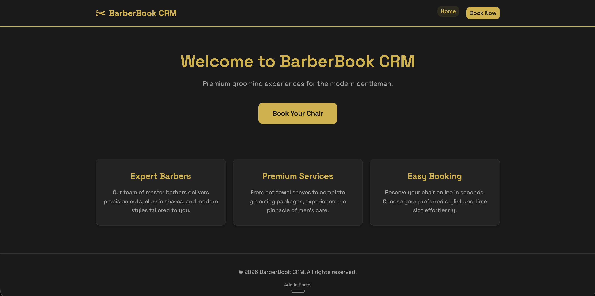
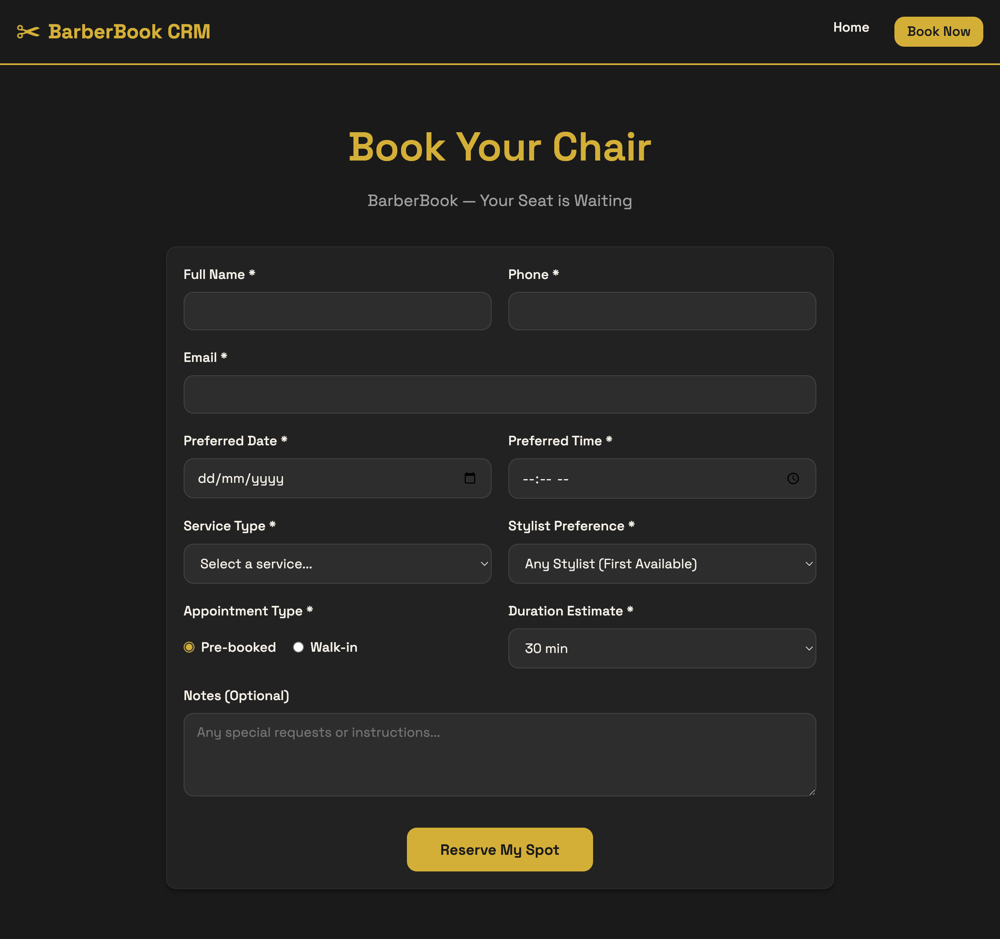
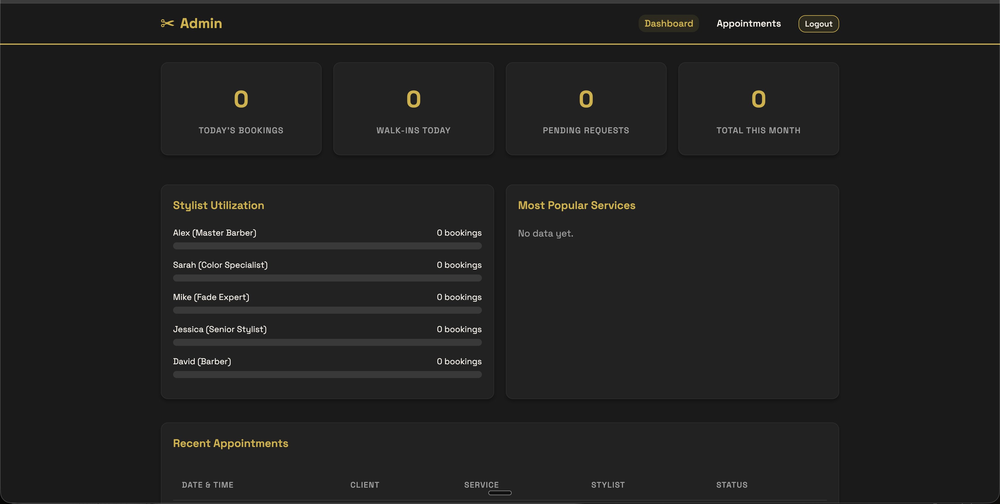

# BarberBook CRM

> A lightweight appointment and client management CRM built for barber shops and hair salons. Tracks services, stylists, walk-ins vs bookings, and session duration — all with a luxury dark-gold aesthetic and zero database setup.


## Features

- Public booking form — Name, Phone, Email, Service Type, Stylist, Appointment Type (Walk-in / Pre-booked), Duration
- Service types — Haircut, Beard Trim, Color & Highlights, Hair Treatment, Kids Cut, Full Package, Other
- Admin dashboard — Today's Bookings, Walk-ins Today, Pending Requests, Total This Month
- Stylist Utilization chart — CSS horizontal bars per stylist
- Most Popular Service — top 3 services ranked as pill badges
- Filters — service type, stylist, appointment type, date, status
- Flat-file JSON storage — zero SQL setup required
- bcrypt password login + PHP session auth
- **Central Configuration** — easily customize clinic details, stylists, and services via `config.php`

- ## Screenshots








## Tech Stack

| Layer | Technology |
|---|---|
| Language | PHP (Server-Side Rendering) |
| Frontend | HTML5, Vanilla CSS, Google Fonts |
| Storage | Flat-File JSON (appointments.json, meta.json) |
| Auth | PHP Native Sessions + bcrypt |
| Server | Apache / Any PHP 7.4+ host |

## Getting Started

### Requirements
- PHP 7.4 or higher
- Apache or Nginx with PHP support
- No database required

### Installation

```bash
git clone https://github.com/YOUR_USERNAME/barberbook-crm.git
cd barberbook-crm
chmod 755 data/
cp includes/config.example.php includes/config.php
```

> **Note:** Open `includes/config.php` and update the admin credentials, clinic details, and services before deploying.

Visit:
  http://localhost/barberbook-crm/          # Public Booking Form
  http://localhost/barberbook-crm/admin/    # Admin Login

  ## Admin Login

There is no default password. Before you can log in, you must set your admin credentials in `includes/config.php`.

1. Generate a secure bcrypt password hash using PHP:
   ```bash
   php -r "echo password_hash('your_password_here', PASSWORD_BCRYPT, ['cost' => 12]);"
   ```
2. Open `includes/config.php` and paste the generated hash into `ADMIN_PASSWORD_HASH`.
3. Set your preferred `ADMIN_USERNAME` (default is `admin`).

## File Structure

```text
barberbook-crm/
├── assets/style.css
├── data/
│   ├── .htaccess
│   ├── appointments.json
│   └── meta.json
├── includes/
│   ├── auth.php
│   ├── config.example.php
│   ├── config.php
│   └── storage.php
├── admin/
│   ├── login.php
│   ├── logout.php
│   ├── dashboard.php
│   └── appointments.php
├── book.php
└── index.php
```

## Appointment Schema

```json
{
  "id": 1,
  "name": "Khalid Hassan",
  "phone": "+971501234567",
  "email": "khalid@example.com",
  "date": "2025-07-20",
  "time": "11:00",
  "service_type": "Full Package",
  "stylist": "Ahmed",
  "appointment_type": "booked",
  "duration_estimate": "90 min",
  "status": "Pending",
  "created_at": "2025-07-10 09:00:00"
}
```

## Security

- All user input sanitized with htmlspecialchars() before rendering
- Admin password stored as bcrypt hash — never plain text
- data/ directory protected via auto-generated .htaccess
- Admin routes protected by session middleware (require_login())

"## Roadmap

- [ ] Email confirmation to client on booking (PHPMailer)
- [ ] Walk-in queue tracker — live count of waiting clients
- [ ] Stylist-specific schedule view
- [ ] Recurring appointment support (weekly regulars)
- [ ] CSRF token protection on all forms"

"## Contributing

Contributions welcome! Fork, open issues, or submit pull requests.

## License

Licensed under the MIT License."

## Author

**Ahmed Ali**
- GitHub: [@ahmed-ali-codes](https://github.com/ahmed-ali-codes)
- LinkedIn: [linkedin.com/in/ahmed-ali-jawad](https://linkedin.com/in/ahmed-ali-jawad)
- Agency: [Ecotrustia Solutions](https://ecotrustiasolutions.com)


## Related Projects

| Project | Niche |
|---|---|
| [SmileCare Dental CRM](https://github.com/ahmed-ali-codes/smilecare-dental-crm) | Dental clinics |
| [MediTrack Clinic CRM](https://github.com/ahmed-ali-codes/meditrack-clinic-crm) | General clinics |
| [BarberBook CRM](https://github.com/ahmed-ali-codes/barberbook-crm) | Barber Shops & Salons |
| [SparkClean CRM](https://github.com/ahmed-ali-codes/sparkclean-crm) | Home & Office Cleaning |
| [PetPaws CRM](https://github.com/ahmed-ali-codes/petpaws-crm) | Veterinary & Pet Grooming |
| [GlowSpa CRM](https://github.com/ahmed-ali-codes/glowspa-crm) | Spas & Beauty Salons |
| [FitBook CRM](https://github.com/ahmed-ali-codes/fitbook-crm) | Personal Trainers & Gyms |
| [LegalDesk CRM](https://github.com/ahmed-ali-codes/legaldesk-crm) | Law Firms |
| [TaxMate CRM](https://github.com/ahmed-ali-codes/taxmate-crm) | Accounting & Tax |
| [PropView CRM](https://github.com/ahmed-ali-codes/propview-crm) | Real Estate |
| [TutorDesk CRM](https://github.com/ahmed-ali-codes/tutordesk-crm) | Private Tutors |
| [EventFlow CRM](https://github.com/ahmed-ali-codes/eventflow-crm) | Event Planning |
